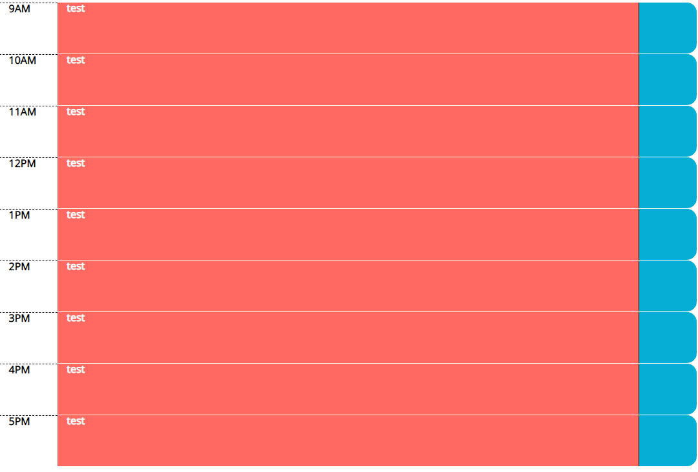

# Day Manager



This project was an effort to use just scripting to make a day planeer along side the provided html and css.

This is currently unfinished

I have also deployed it as a [GitHub Page](https://nabhahnk.github.io/day-manager/).

# JavaScript 

I have made three functions, One to make the area that shows the hour,textfield, and submit button. The second, To save any text a user inputs to an hour. The third, To get any saved user text and set it to the hour it was save in. 

```javascript
function rowMaker() {
    for (let i = 0; i < hour.length; i++) {
        let row = document.createElement("form");
        let time = document.createElement("label");
        let input = document.createElement("textarea");
        let info = document.createElement("th");
        let saveBtn = document.createElement("input");

        row.classList.add("row", "col-12");
        time.classList.add("hour", "col-1");

        time.innerHTML = hour[i];
        row.appendChild(time);

        info.innerHTML = placeHolderText;
        input.innerHTML = placeHolderText;

        if (moment(timeSlot[i]).isAfter()) {
            input.classList.add("description", "col-10", "future");
            input.setAttribute("id", hour[i]);
            row.appendChild(input);
        } else if (moment(timeSlot[i]).isSame(moment().startOf('hour'))) {
            info.classList.add("description", "col-10", "present");
            info.setAttribute("id", hour[i]);
            row.appendChild(info);
        } else {
            info.classList.add("description", "col-10", "past");
            info.setAttribute("id", hour[i]);
            row.appendChild(info);
        }

        saveBtn.setAttribute("type", "submit");
        saveBtn.setAttribute("value", "submit");
        saveBtn.setAttribute("data-id", hour[i]);
        saveBtn.classList.add("saveBtn", "col-1");

        row.appendChild(saveBtn);

        schedule.appendChild(row);
        setInfo(i);
    }
}
```

```javascript
function saveInfo(event) {
    event.preventDefault();
    let ifBtn = event.target.dataset.id;
    if (!ifBtn) return;
    let btnInfo = document.getElementById(ifBtn);
    let theInfo = btnInfo.value;
    
    localStorage.setItem(ifBtn, theInfo);
}
```

```javascript
function setInfo(x) {
    let textArea = document.getElementById(hour[x]);
    if (localStorage.getItem(hour[x])) {
        textArea.innerHTML = localStorage.getItem(hour[x]);
    }
}
```

The second funtion currently colors all the rows to the color that means time is up.